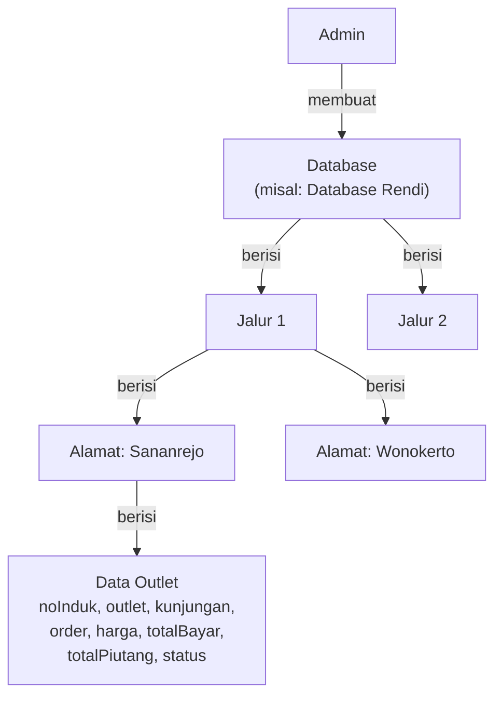

# Dashboard Admin Kopi Bima — Pengelolaan Data Jalur/Outlet

Dashboard admin untuk mengelola data operasional lapangan dan keuangan outlet, dengan struktur hierarki **Database → Jalur → Alamat → Data Outlet**.

## Klarifikasi yang Diterima

| Item | Detail |
|------|--------|
| **Order** | Satuan kardus (desimal: 0.2, 0.5, 1, dst). Harga default Rp 100.000/kardus, bisa custom |
| **Kunjungan** | Setiap minggu sekali (tanggal kunjungan) |
| **Upload** | CSV + Excel (`.xlsx`) |
| **Hierarki** | Admin → Database → Jalur → Alamat → Data Outlet |

## User Review Required

> [!IMPORTANT]
> **Kalkulasi Otomatis**: `totalPiutang` akan dihitung otomatis: `(order × harga) - totalBayar`. Jadi admin hanya input `order`, `harga`, dan `totalBayar`. Apakah ini benar, atau `totalPiutang` diinput manual?

> [!IMPORTANT]
> **Penyimpanan Data**: Tetap menggunakan file JSON di server (tanpa database server). Satu file JSON per database yang dibuat admin. Cocok untuk prototype/demo.

## Data Model & Hierarki



### Struktur Data Outlet

| Field | Tipe | Keterangan |
|-------|------|------------|
| `id` | string | Auto-generated UUID |
| `noInduk` | string | Nomor unik identifikasi |
| `outlet` | string | Nama toko/pelanggan |
| `kunjungan` | string (date) | Tanggal kunjungan (mingguan) |
| `order` | number | Jumlah kardus (desimal: 0.2, 0.5, 1, dst) |
| `harga` | number | Harga per kardus (default: 100000) |
| `totalBayar` | number | Nominal yang sudah dibayarkan |
| `totalPiutang` | number | **Computed**: `(order × harga) - totalBayar` |
| `status` | string | **Computed**: `totalPiutang > 0 ? "Piutang" : "Lunas"` |

---

## Proposed Changes

### Routing & Navigation

Navigasi menggunakan breadcrumb + nested routes:

```
/                                          → Daftar Database
/db/[dbId]                                 → Daftar Jalur dalam Database
/db/[dbId]/jalur/[jalurId]                 → Daftar Alamat dalam Jalur
/db/[dbId]/jalur/[jalurId]/alamat/[alamatId] → Tabel Data Outlet
```

---

### Data Layer

#### [NEW] [src/lib/types.ts](file:///home/randukumbolo/Workspace/vscode/kopi_bima/src/lib/types.ts)
- Interface `Database` — `{ id, name, createdAt }`
- Interface `Jalur` — `{ id, dbId, name, createdAt }`
- Interface `Alamat` — `{ id, jalurId, name, createdAt }`
- Interface `Outlet` — semua field di tabel di atas
- Interface `OutletFormData` — input fields (tanpa computed)

#### [NEW] [src/lib/store.ts](file:///home/randukumbolo/Workspace/vscode/kopi_bima/src/lib/store.ts)
- Penyimpanan JSON: satu file `data/store.json` berisi semua data
- Struktur: `{ databases: [], jalur: [], alamat: [], outlets: [] }`
- Fungsi CRUD untuk setiap entitas:
  - Database: `getDatabases()`, `createDatabase()`, `deleteDatabase()`
  - Jalur: `getJalurByDb()`, `createJalur()`, `deleteJalur()`
  - Alamat: `getAlamatByJalur()`, `createAlamat()`, `deleteAlamat()`
  - Outlet: `getOutletsByAlamat()`, `createOutlet()`, `updateOutlet()`, `deleteOutlet()`, `bulkCreateOutlets()`
- Cascade delete (hapus database → hapus semua jalur, alamat, outlet di dalamnya)

---

### Server Actions

#### [NEW] [src/app/actions.ts](file:///home/randukumbolo/Workspace/vscode/kopi_bima/src/app/actions.ts)
- **Database**: `createDatabaseAction()`, `deleteDatabaseAction()`
- **Jalur**: `createJalurAction()`, `deleteJalurAction()`
- **Alamat**: `createAlamatAction()`, `deleteAlamatAction()`
- **Outlet**: `createOutletAction()`, `updateOutletAction()`, `deleteOutletAction()`, `uploadOutletsAction()` (CSV/Excel parsing + bulk insert)
- Semua action menggunakan `revalidatePath()` setelah mutasi

---

### UI Components

Design: Dark theme dengan aksen amber/warm (tema kopi), glassmorphism, micro-animations.

#### [MODIFY] [globals.css](file:///home/randukumbolo/Workspace/vscode/kopi_bima/src/app/globals.css)
- Dark theme color palette, CSS custom properties
- Animasi & transition utilities
- Glassmorphism & gradient effects

#### [MODIFY] [layout.tsx](file:///home/randukumbolo/Workspace/vscode/kopi_bima/src/app/layout.tsx)
- Metadata: "Kopi Bima — Dashboard Admin"
- Sidebar + main content layout
- Font: Inter dari Google Fonts

#### [NEW] [src/components/Sidebar.tsx](file:///home/randukumbolo/Workspace/vscode/kopi_bima/src/components/Sidebar.tsx)
- Brand "Kopi Bima" dengan ikon kopi
- Menu navigasi: Dashboard, link ke database aktif
- Collapsible di mobile

#### [NEW] [src/components/Breadcrumb.tsx](file:///home/randukumbolo/Workspace/vscode/kopi_bima/src/components/Breadcrumb.tsx)
- Breadcrumb navigasi: Database > Jalur > Alamat
- Clickable links untuk navigasi ke atas

#### [NEW] [src/components/ItemCard.tsx](file:///home/randukumbolo/Workspace/vscode/kopi_bima/src/components/ItemCard.tsx)
- Card reusable untuk menampilkan Database, Jalur, atau Alamat
- Gradient border, hover animation, delete button
- Menampilkan jumlah child items

#### [NEW] [src/components/StatsCards.tsx](file:///home/randukumbolo/Workspace/vscode/kopi_bima/src/components/StatsCards.tsx)
- Ringkasan di halaman outlet: Total Outlet, Total Lunas, Total Piutang, Total Pendapatan
- Gradient backgrounds dengan ikon

#### [NEW] [src/components/DataTable.tsx](file:///home/randukumbolo/Workspace/vscode/kopi_bima/src/components/DataTable.tsx)
- Client component — Tabel data outlet
- Kolom: No Induk, Outlet, Kunjungan, Order (kardus), Harga, Total Bayar, Total Piutang, Status, Aksi
- Badge status (hijau=Lunas, merah=Piutang)
- Search/filter, sorting
- Format currency Rp

#### [NEW] [src/components/OutletFormModal.tsx](file:///home/randukumbolo/Workspace/vscode/kopi_bima/src/components/OutletFormModal.tsx)
- Modal form Create & Edit outlet
- Field: noInduk, outlet, kunjungan (date picker), order (number), harga (default 100000), totalBayar
- Auto-calculate preview: totalPiutang dan status
- Animasi modal

#### [NEW] [src/components/UploadModal.tsx](file:///home/randukumbolo/Workspace/vscode/kopi_bima/src/components/UploadModal.tsx)
- Upload CSV/Excel dengan drag & drop
- Preview data sebelum import
- Template download (contoh format)
- Parsing CSV native + Excel via `xlsx` library

#### [NEW] [src/components/CreateModal.tsx](file:///home/randukumbolo/Workspace/vscode/kopi_bima/src/components/CreateModal.tsx)
- Modal reusable untuk membuat Database, Jalur, atau Alamat baru
- Input nama + validasi

#### [NEW] [src/components/DeleteConfirmModal.tsx](file:///home/randukumbolo/Workspace/vscode/kopi_bima/src/components/DeleteConfirmModal.tsx)
- Dialog konfirmasi hapus dengan warning
- Untuk semua level (database, jalur, alamat, outlet)

---

### Pages

#### [MODIFY] [src/app/page.tsx](file:///home/randukumbolo/Workspace/vscode/kopi_bima/src/app/page.tsx)
- Halaman utama: daftar Database
- Tombol "Buat Database Baru"
- Card grid untuk setiap database

#### [NEW] [src/app/db/[dbId]/page.tsx](file:///home/randukumbolo/Workspace/vscode/kopi_bima/src/app/db/[dbId]/page.tsx)
- Daftar Jalur dalam database terpilih
- Breadcrumb: Home > [Nama Database]
- Tombol "Tambah Jalur"
- Card grid untuk setiap jalur

#### [NEW] [src/app/db/[dbId]/jalur/[jalurId]/page.tsx](file:///home/randukumbolo/Workspace/vscode/kopi_bima/src/app/db/[dbId]/jalur/[jalurId]/page.tsx)
- Daftar Alamat dalam jalur terpilih
- Breadcrumb: Home > [Database] > [Jalur]
- Tombol "Tambah Alamat"
- Card grid untuk setiap alamat

#### [NEW] [src/app/db/[dbId]/jalur/[jalurId]/alamat/[alamatId]/page.tsx](file:///home/randukumbolo/Workspace/vscode/kopi_bima/src/app/db/[dbId]/jalur/[jalurId]/alamat/[alamatId]/page.tsx)
- **Halaman utama pengelolaan data outlet**
- Breadcrumb: Home > [Database] > [Jalur] > [Alamat]
- StatsCards (ringkasan)
- DataTable (tabel data outlet)
- Tombol: "Tambah Data", "Upload CSV/Excel"
- Search bar

#### [NEW] [src/app/db/[dbId]/layout.tsx](file:///home/randukumbolo/Workspace/vscode/kopi_bima/src/app/db/[dbId]/layout.tsx)
- Shared layout untuk semua halaman di bawah database

---

### Dependencies

#### [MODIFY] [package.json](file:///home/randukumbolo/Workspace/vscode/kopi_bima/package.json)
- `xlsx` — parsing file Excel
- `uuid` + `@types/uuid` — generate ID unik

---

## Verification Plan

### Automated Tests
```bash
npm run build
```

### Manual Verification
1. Buat Database → muncul di halaman utama
2. Buat Jalur → muncul di halaman database
3. Buat Alamat → muncul di halaman jalur
4. CRUD outlet: Create, Read, Edit, Delete
5. Upload CSV/Excel → data masuk bulk
6. Verifikasi kalkulasi otomatis totalPiutang dan status
7. Verifikasi cascade delete (hapus database → semua data hilang)
8. Responsive: cek di mobile & desktop
